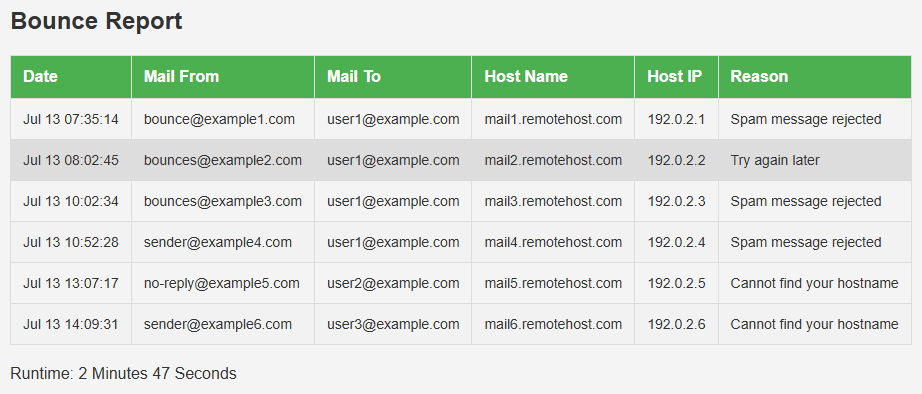

# postfix-bounce-report
The script generates an HTML report based on rejected messages. Another script continuously writes "recipient addresses" into a list. If an incoming message is rejected and is present in the list of "recipients", the subject of email is changing.

<!-- TOC -->

- [postfix-bounce-report](#postfix-bounce-report)
    - [FEATURES](#features)
    - [EXAMPLE](#example)
    - [HOW TO INSTALL](#how-to-install)
        - [PREREQUISITES PERL INTERPRETER](#prerequisites-perl-interpreter)
        - [CLONE REPOSITORY](#clone-repository)
    - [HOW TO USE](#how-to-use)
        - [CONFIGURATION](#configuration)
        - [CREATE SCHEDULED TASKS](#create-scheduled-tasks)
    - [ADDITIONAL INFORMATION](#additional-information)
    - [LICENSE](#license)

<!-- /TOC -->

## FEATURES
- build_submission_recipients.sh	: Analyzes the postfix maillog for outgoing e-mails and continuously creates a list of recipients
- postfix-bounce-report.sh		: Analyzes the postfix logfile for bounced emails by DDNS blacklist, optionaly validate/cross check FROM-value against submission list. Script also generates HTML report and send via sendmail
- The subject is regular "[INFO] Postfix Bounce Report", a threshold value can be parameterized where the subject is changed to [WARNING]. For a match with the submission recipients list a [CRITIAL] is created

## EXAMPLE


## HOW TO INSTALL

### PREREQUISITES PERL INTERPRETER

Install Perl Package
- Once System is fully updated, you can install perl package through ```dnf install perl``` command.

Check Perl Version
- Since the package is installed now, you can check the Perl version through ```perl -v``` command.

### CLONE REPOSITORY
Change to the root-directory of your linux-system: ```cd ~```

Clone the repository to this directory: ```git clone https://github.com/filipnet/postfix-bounce-report.git```
Afterwards you will find a new folder called "postfix-bounce-report" inside your root-directory
To make the scripts universally applicable, some settings like email addresses are stored in a separate ```config.xml``` and must be adjusted here, the existing ```config.xml.sample``` renamed and adjusted before.
Please note that the scripts must be made executable before the first use. ```chmod +x ~/*.sh```

## HOW TO USE

### CONFIGURATION
Rename the file ```config.xml.sample``` to ```config.xml``` and adapt it to your system environment.
```
cd ~/postfix-bounce-report
cp config.xml.sample config.xml
vim/nano config.xml
```

### CREATE SCHEDULED TASKS
Create an entry in  ```/etc/crontab``` with the following content:

```
# https://github.com/filipnet/postfix-bounce-report
@hourly root /root/postfix-bounce-report/postfix-build-submission-recipients.sh > /dev/null
@daily root /root/postfix-bounce-report/postfix-bounce-report.sh > /dev/null
```

Description
- The script ```postfix-build-submission-recipients.sh``` scans the mail log every hour for sent e-mails, extracts the recipient's address and adds it to the list ```/etc/postfix/submission_recipients``` if not already present.
- The script ```postfix-bounce-report.sh``` is executed once a day, returns as content an HTML table with cross-check to the submission list, sends it via e-mail.

## ADDITIONAL INFORMATION
Please note that the script ```postfix-bounce-report.sh``` always generates the day before. Note if there are no conflict with your log-rotation jobs.

## LICENSE
postfix-bounce-report and all individual scripts are under the BSD 3-Clause license unless explicitly noted otherwise. Please refer to the LICENSE